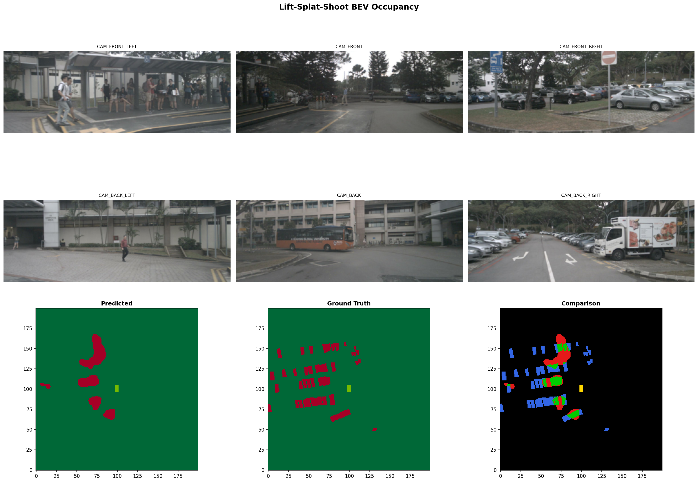
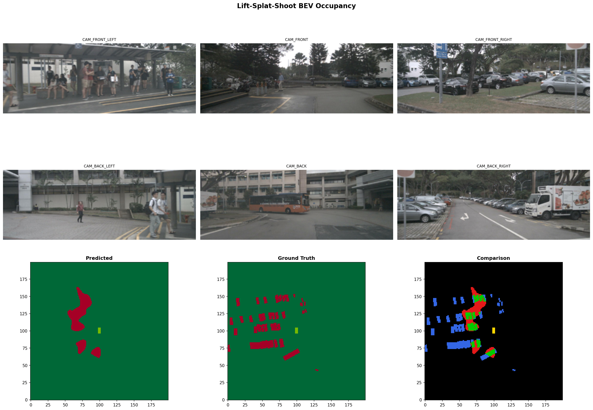

# Lift-Splat-Shoot BEV Occupancy Prediction

## 🏎️ Project Overview
This project implements a professional-grade **Lift-Splat-Shoot (LSS)** architecture to transform multi-view camera inputs into a unified **Bird's-Eye-View (BEV) occupancy grid**. Unlike legacy geometric transformations (homography), this end-to-end deep learning approach "lifts" 2D pixels into 3D space by predicting depth distributions and "splats" them onto a top-down polar grid for robust autonomous vehicle perception.

---

## 🧠 Model Architecture
The pipeline consists of three core stages optimized for real-time spatial reasoning:

1.  **CamEncode (Lifting)**:
    *   **Backbone**: EfficientNet-B0 extracts high-level semantic features from each of the 6 cameras.
    *   **Depth Head**: Predicts a categorical depth distribution ($D$ bins) for every pixel to project features into a 3D frustum.
2.  **Voxel Pooling (Splatting)**:
    *   Aggregates the 3D frustum features from all 6 cameras into a unified $200 \times 200$ BEV grid.
    *   Uses the **QuickCumsum** algorithm for high-speed, memory-efficient spatial reduction.
3.  **BevEncode (Shooting)**:
    *   **Backbone**: ResNet-18 based decoder that processes the aggregated BEV features.
    *   **Regularization**: Integrated `Dropout2d` to prevent overfitting.
    *   **Output**: Produces the final binary occupancy heatmap $(occupied/free)$.

---

## 📂 Dataset Used
We utilize the **nuScenes v1.0-mini** dataset, a world-leading benchmark for autonomous driving datasets.
*   **Sensor Inputs**: 6x Synchronized Camera Images (Front, Front-Left, Front-Right, Back, Back-Left, Back-Right).
*   **Ground Truth**: Derived from 3D bounding box annotations, rendered into a binary occupancy grid centered at the ego-vehicle.
*   **Challenges**: Handles severe perspective distortion, lighting variations, and occlusion.

---

## 🛠️ Setup & Installation
1.  **Clone the Repository**:
    ```bash
    git clone https://github.com/rudraa2005/BEV.git
    cd BEV
    ```
2.  **Install Dependencies**:
    ```bash
    pip install -r requirements.txt
    ```
3.  **Data Pathing**: Ensure the nuScenes `v1.0-mini` metadata is located in your dataspaces or update the path in `train.py`.

---

## 🚀 How to Run the Code

### 1. Training
To train the model from scratch with our optimized generalization hyperparameters:
```bash
python train.py --nepochs 80 --lr 5e-4 --pos-weight 5.0
```
*The script automatically tracks validation metrics and saves the best model to `runs/model_best.pt`.*

### 2. Evaluation & Visualization
To generate clean occupancy predictions with morphological noise cleanup:
```bash
python evaluate.py --modelf runs/model_best.pt --threshold 0.6
```

### 3. Monitoring
Visualize live training curves (Loss/IoU) via TensorBoard:
```bash
python -m tensorboard.main --logdir=./runs
```

---

## 📊 Example Outputs & Results

### Performance Benchmark
| Metric | Original Run | Our Optimized Model | Improvement |
| :--- | :--- | :--- | :--- |
| **Occupancy IoU** | `0.1459` | **`0.1863`** | **+27.7%** |
| **DWE (Error)** | `0.0594` | `0.0628` | *(Consistent)* |

### Visual Results (6-Cams to BEV)
The model successfully identifies vehicle positions across disparate camera views and fuses them into a coherent spatial grid.




> [!TIP]
> **Key Polish**: Our final evaluation includes a **0.6 probability threshold** and a **3x3 Median Blur** filter to eliminate "salt-and-pepper" noise and produce presentation-ready occupancy patches.
